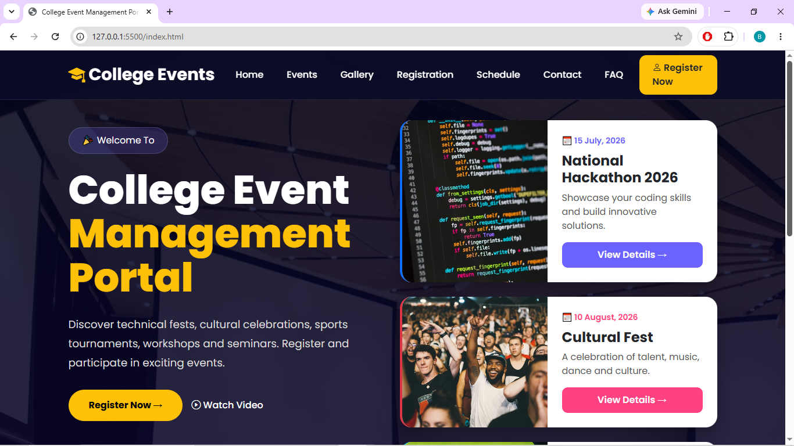
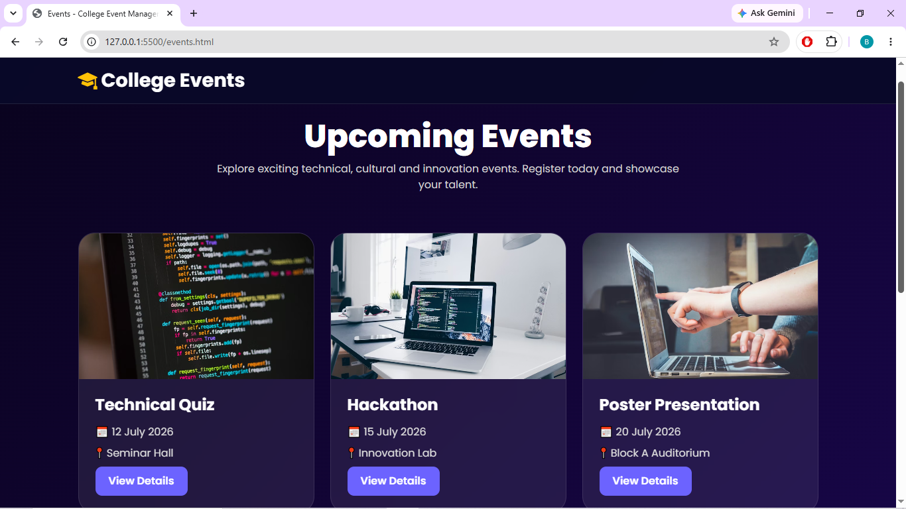
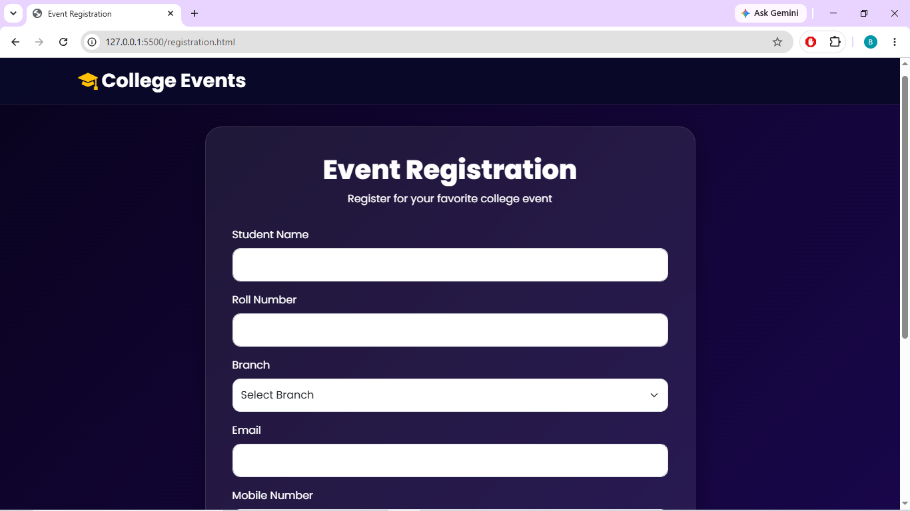
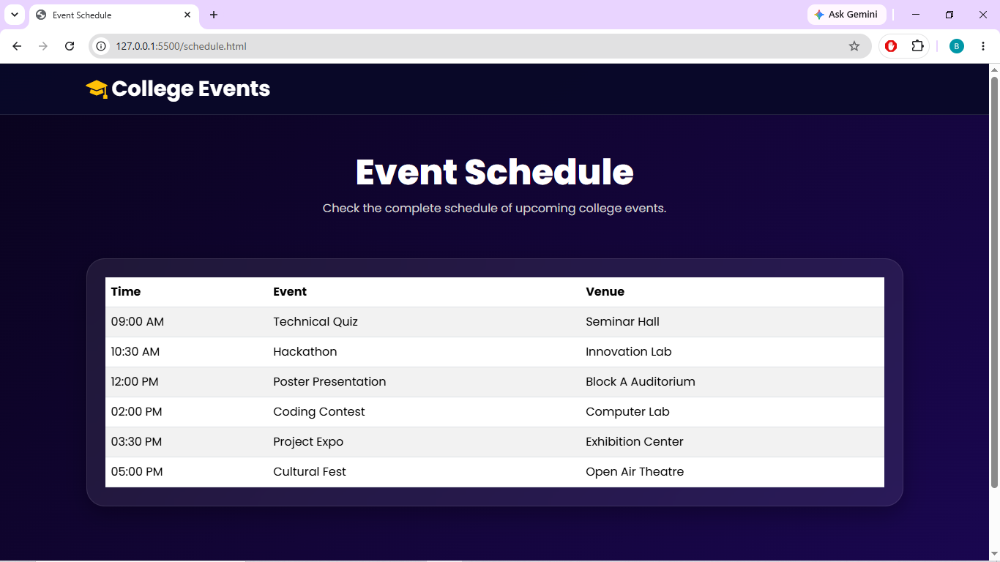
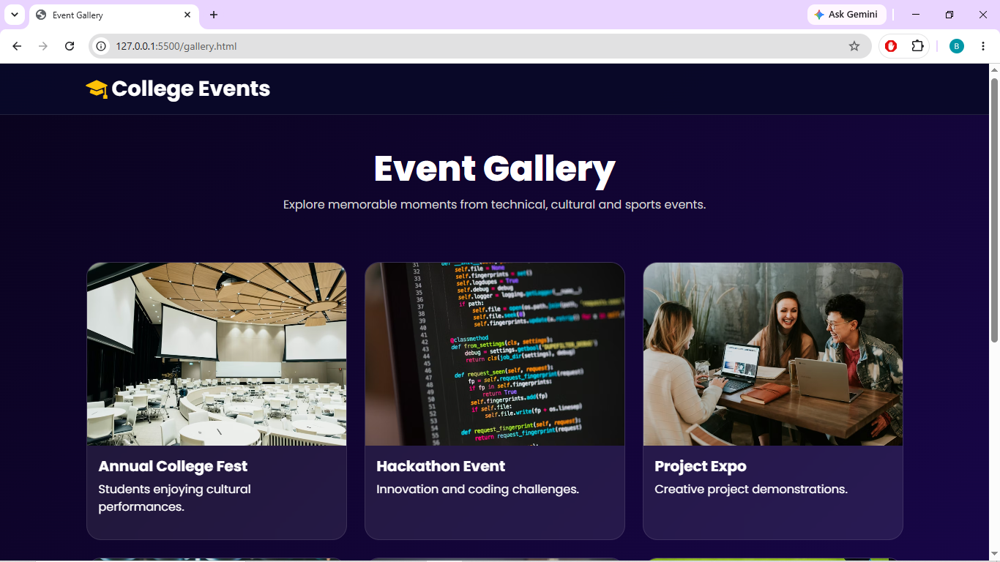
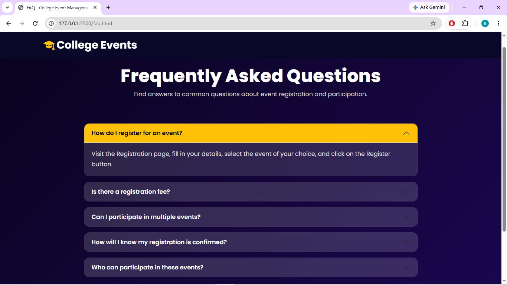
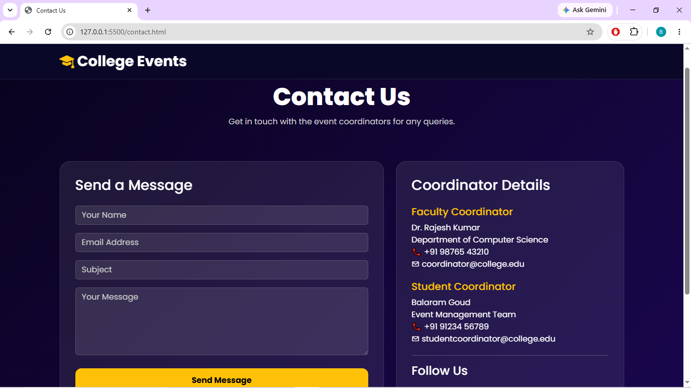

# College Event Management Portal

## Project Overview

The **College Event Management Portal** is a responsive web application developed using **HTML5, CSS3, Bootstrap 5, and JavaScript**. The portal allows students to view upcoming college events, register for events, explore event galleries, check schedules, browse FAQs, and contact event coordinators.

The project focuses on creating a modern, user-friendly, and responsive interface while utilizing various Bootstrap components.

### Features

* Responsive Navigation Bar
* Attractive Home Page with Event Highlights
* Events Listing Page
* Event Registration Form
* Event Schedule Table
* Event Gallery
* FAQ Section using Accordion
* Contact Page with Coordinator Details
* Event Detail Modals
* Registration Success Alerts
* Mobile-Friendly Design

---

## Pages Included

### 1. Home Page

* Hero Section
* Event Highlights
* Featured Events
* Statistics Section

### 2. Events Page

* Technical Quiz
* Hackathon
* Poster Presentation
* Coding Contest
* Project Expo
* Cultural Fest

### 3. Registration Page

* Student Registration Form
* Success Alert Message

### 4. Event Schedule Page

* Responsive Schedule Table

### 5. Gallery Page

* Event Photographs
* Responsive Card Layout

### 6. FAQ Page

* Bootstrap Accordion

### 7. Contact Page

* Contact Form
* Coordinator Details
* Social Media Links

---

## Bootstrap Components Used

* Navbar
* Cards
* Buttons
* Forms
* Tables
* Accordion
* Alerts
* Modal
* Grid System
* Responsive Utilities

---

## Technologies Used

| Technology             | Purpose                        |
| ---------------------- | ------------------------------ |
| HTML5                  | Structure                      |
| CSS3                   | Styling                        |
| Bootstrap 5            | Responsive Design & Components |
| Bootstrap Icons        | Icons                          |
| JavaScript             | Interactive Features           |
| Google Fonts (Poppins) | Typography                     |

---

## Screenshots

### Home Page



### Events Page



### Registration Page



### Schedule Page



### Gallery Page



### FAQ Page



### Contact Page



> Create a `screenshots` folder inside your repository and place all page screenshots there.

---

## Project Structure

```text
College-Event-Management-Portal/
│
├── index.html
├── events.html
├── registration.html
├── schedule.html
├── gallery.html
├── faq.html
├── contact.html
│
├── css/
│   └── style.css
│
├── screenshots/
│   ├── home.png
│   ├── events.png
│   ├── registration.png
│   ├── schedule.png
│   ├── gallery.png
│   ├── faq.png
│   └── contact.png
│
└── README.md
```

---

## GitHub Repository Link

Replace the link below with your repository URL:

```text
https://github.com/balaram596/GitDemo.git
```

Example:

```text
https://github.com/balaram596/GitDemo.git
```

---

## Future Enhancements

* Database Integration
* User Authentication
* Online Event Registration Storage
* Admin Dashboard
* Event Notifications
* Certificate Generation

---

## Author

**Balaram Goud**

College Event Management Portal Project
Developed using HTML, CSS, Bootstrap, and JavaScript.
