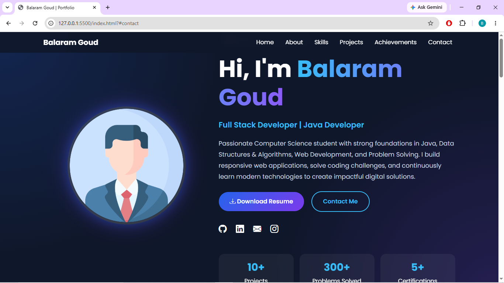
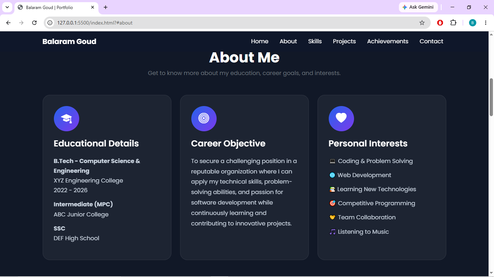
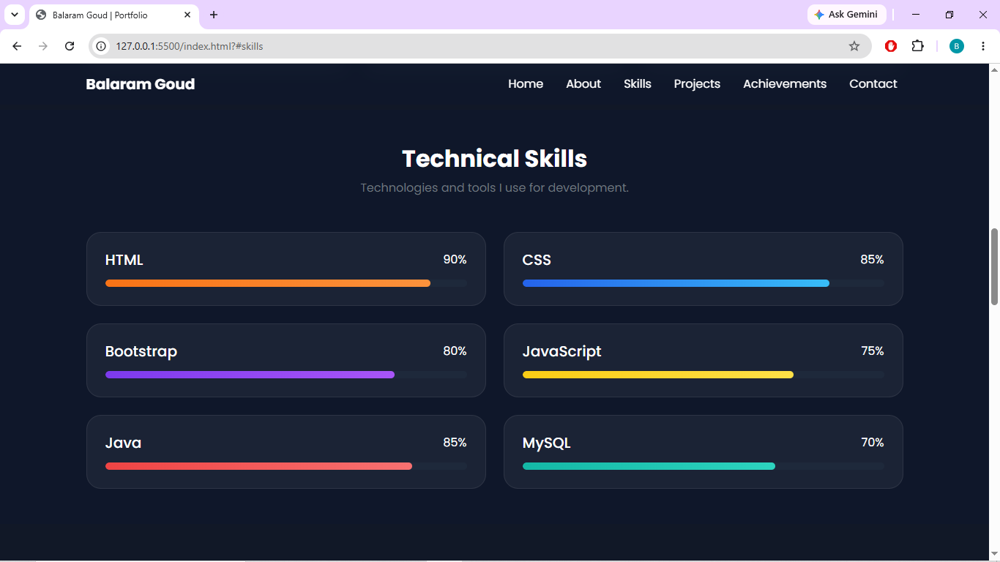
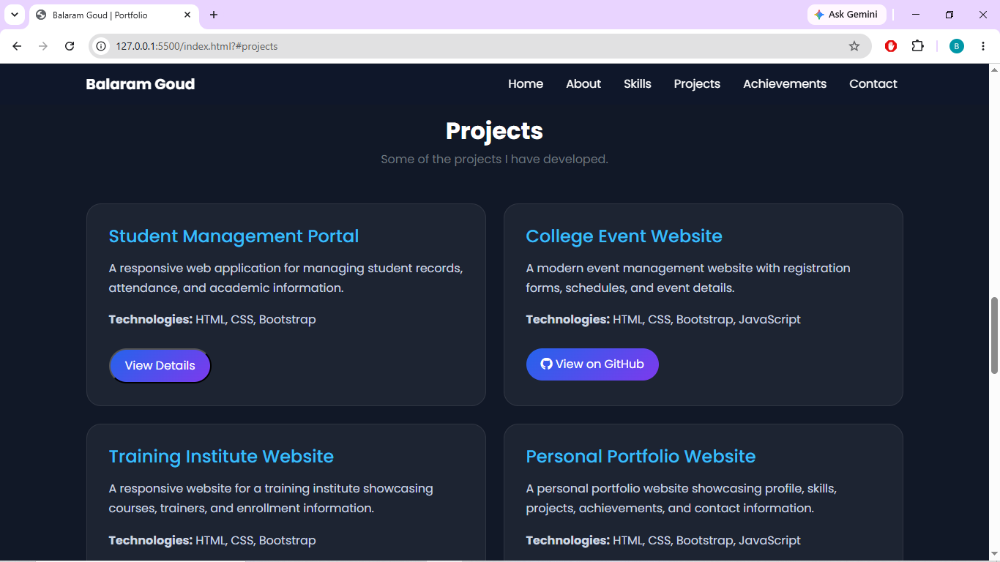
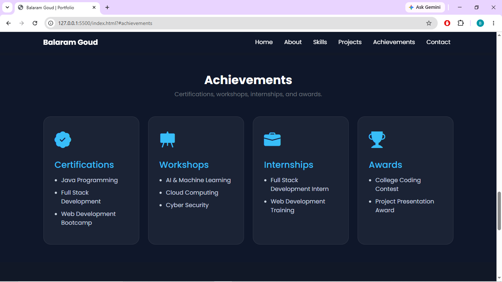
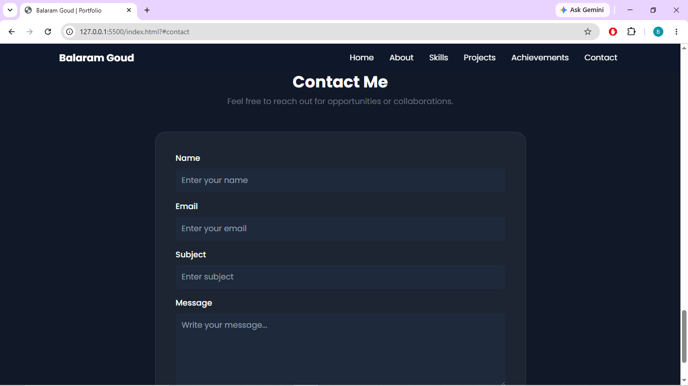

# Personal Portfolio Website

## 📌 Project Overview

This project is a responsive Personal Portfolio Website developed using HTML, CSS, Bootstrap 5, and Bootstrap Icons. The portfolio showcases personal information, educational background, technical skills, projects, achievements, and contact details in a modern and professional interface.

The website is designed to provide recruiters, faculty members, and visitors with a comprehensive overview of the developer's profile and accomplishments.

---

## ✨ Features

### Home Section

* Professional profile photo
* Name and designation
* Short introduction
* Resume download button
* Social media links

### About Me Section

* Educational details
* Career objective
* Personal interests

### Skills Section

* Technical skills displayed using progress bars
* Responsive skill cards
* Modern UI design

### Projects Section

* Project cards
* Project descriptions
* Technologies used
* GitHub repository links
* Bootstrap modal for project details

### Achievements Section

* Certifications
* Workshops
* Internships
* Awards

### Contact Section

* Contact form
* Name
* Email
* Subject
* Message

### Bootstrap Components Used

* Navbar
* Cards
* Progress Bars
* Forms
* Buttons
* Modal
* Grid System

---

## 🛠 Technologies Used

* HTML5
* CSS3
* Bootstrap 5
* Bootstrap Icons
* Google Fonts (Poppins)

---

## 📂 Project Structure

```
Portfolio/
│
├── index.html
├── resume.pdf
├── README.md
└── images/
    ├── home.png
    ├── about.png
    ├── skills.png
    ├── projects.png
    ├── achievements.png
    └── contact.png
```

---

## 📸 Screenshots

### Home Page

Insert screenshot here:



### About Me

Insert screenshot here:



### Skills Section



### Projects Section



### Achievements Section



### Contact Section



---

## 🚀 How to Run

1. Download or clone the repository.
2. Open the project folder.
3. Open `index.html` in any modern web browser.

---

## 🔗 GitHub Repository

Repository Link:

https://github.com/balaram596/GitDemo.git

---

## 👨‍💻 Author

**Balaram Goud**

* Full Stack Developer

---

## 📄 License

This project is created for educational and portfolio purposes.
